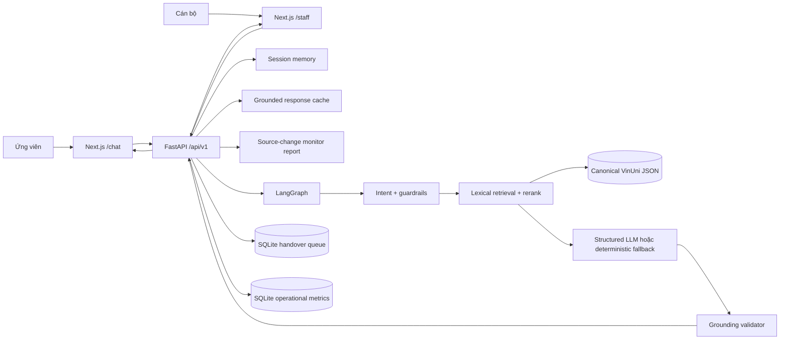
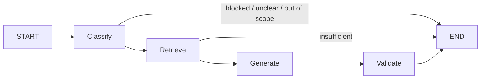

# Kiến trúc VinUni Admissions Assistant

## Tổng quan

Frontend Next.js cung cấp hai không gian cho ứng viên và cán bộ; FastAPI điều
phối phiên, handover và một LangGraph bốn bước: phân loại câu hỏi, truy xuất dữ
liệu, tạo câu trả lời có cấu trúc, rồi kiểm tra grounding. Hệ thống áp dụng
fail-closed: nếu không đủ evidence, gặp trạng thái dữ liệu không an toàn hoặc
phát hiện số không có trong nguồn, hệ thống không trả lời như một sự thật.

## Thành phần

### Frontend

- `/`: giới thiệu phạm vi, nguyên tắc accuracy-first và trạng thái kho dữ liệu.
- `/chat`: lưu phiên trong tab, hiển thị trạng thái/citation/cảnh báo, thu feedback, tạo ticket
  sau khi người dùng consent và tự cập nhật phản hồi từ cán bộ.
- `/staff`: xác thực Bearer token, xem metric 30 ngày, lọc ticket, nhận xử
  lý, gửi phản hồi và đóng yêu cầu.
- Không nhúng số liệu tuyển sinh vào mã giao diện; dữ liệu factual đi qua API để
  tránh UI lỗi thời khi canonical dataset thay đổi.

### API

- `POST /api/v1/chat`: hỏi đáp, session ID, trạng thái, citation, confidence và
  gợi ý handover.
- `POST /api/v1/feedback`: ghi nhận helpful/unhelpful khi request thuộc đúng session.
- `GET /api/v1/knowledge/status`: tình trạng dataset, năm học, số tài liệu,
  chunk và nguồn.
- `POST /api/v1/handover`: tạo ticket sau khi người dùng đồng ý.
- `GET /api/v1/handover/{ticket_id}`: người dùng xem ticket thuộc đúng session.
- `/api/v1/staff/tickets/*`: danh sách, nhận, phản hồi và đóng ticket; yêu cầu
  Bearer token.
- `GET /api/v1/staff/analytics`: metric vận hành tổng hợp; yêu cầu Bearer token.
- `GET /api/v1/staff/source-monitor`: trạng thái kiểm tra thay đổi nguồn; yêu cầu Bearer token.
- `GET /ready`: chỉ sẵn sàng khi knowledge base hợp lệ và còn trong thời hạn kiểm chứng.

### LangGraph

- `classify`: phát hiện intent, prompt injection, câu hỏi cam kết kết quả, dữ
  liệu cá nhân phổ biến, dữ liệu chưa công khai và tham chiếu hội thoại thiếu
  ngữ cảnh.
- `retrieve`: BM25-like lexical search, mở rộng từ đồng nghĩa Việt–Anh, lọc theo
  domain và rerank theo loại nguồn/chủ đề.
- `generate`: Structured Outputs khi có OpenAI API key; fallback xác định cho
  môi trường offline và các chủ đề quan trọng.
- `validate`: kiểm tra evidence ID, số liệu, trạng thái evidence và citation.

### Dữ liệu

- Nguồn canonical lấy từ manifest `metadata/vinuni` ở thư mục cha.
- Chỉ file trong manifest được nạp; source ID phải tồn tại trong registry.
- Thứ tự nguồn được ưu tiên trong scoring: policy/PDF có ngày và phiên bản,
  procedure/guideline/curriculum, announcement/program page, webpage, FAQ.
- Các nhãn `unresolved`, `not_publicly_verified`, `restricted`, `dynamic` chặn
  câu trả lời factual và kích hoạt handover.
- Dataset có fingerprint từ manifest/source registry/nội dung canonical. Nếu file thay đổi,
  knowledge base được nạp lại; cache được tách theo fingerprint.
- Source monitor chỉ hash nội dung tải từ HTTPS `*.vinuni.edu.vn`; nguồn thay đổi hoặc không
  truy cập được sẽ chặn câu trả lời liên quan cho đến khi data owner kiểm tra thủ công.

Với dataset hiện tại, index nạp 12 tài liệu canonical, 62 nguồn chính thức và
219 evidence chunks. Con số có thể thay đổi khi cập nhật manifest.

### Lưu trữ

- Session hội thoại: in-memory, có TTL và giới hạn số lượt.
- Handover: SQLite với quyền sở hữu theo session, trạng thái `waiting`,
  `in_progress`, `resolved`.
- Metrics: SQLite chỉ lưu status/intent/reason/latency/counters và hash session;
  không lưu raw question hoặc answer.
- Response cache: in-process TTL, chỉ cho first-turn grounded answer và phân vùng
  theo dataset/năm học/ngày kiểm chứng.
- MVP chưa lưu hồ sơ ứng viên dài hạn và không tự thu thập dữ liệu nhạy cảm.

## Quy tắc độ chính xác

1. Không có evidence phù hợp thì không trả lời factual.
2. Answered response bắt buộc có citation và `grounded=true`.
3. Mọi số có từ hai chữ số trở lên phải xuất hiện trong evidence đã chọn.
4. Evidence ID do mô hình trả về phải thuộc tập truy xuất.
5. Nguồn chưa hoàn tất, nội bộ, động hoặc chưa kiểm chứng bị chặn.
6. Không dự đoán trúng tuyển/học bổng cho hồ sơ cá nhân.
7. Confidence là tín hiệu retrieval, không được diễn giải thành xác suất đúng.
8. Nội dung có dữ liệu cá nhân bị chặn trước retrieval/LLM và không đưa vào session.

## Bảo mật và giới hạn MVP

- Secret chỉ lấy từ biến môi trường; không trả lỗi provider cho client.
- Staff API đóng nếu chưa cấu hình token. Development có thể dùng `STAFF_API_TOKEN`; production
  dùng map `STAFF_TOKENS` để gắn token với định danh cán bộ.
- So sánh token bằng constant-time compare.
- Pydantic giới hạn kích thước input; ticket chỉ nhận contact tùy chọn sau khi
  có consent.
- Frontend Next.js đã hoàn thành ở mức MVP và có Docker image riêng.
- Có rate limit in-process theo client cho các request ghi và giới hạn riêng cho handover.
  Nhiều instance production vẫn cần gateway/shared rate limiter, SSO/JWT/RBAC đầy đủ,
  audit log, Postgres/pgvector và session store phân tán.
