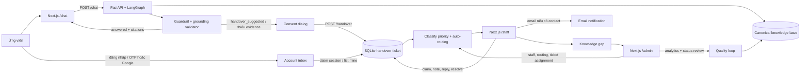
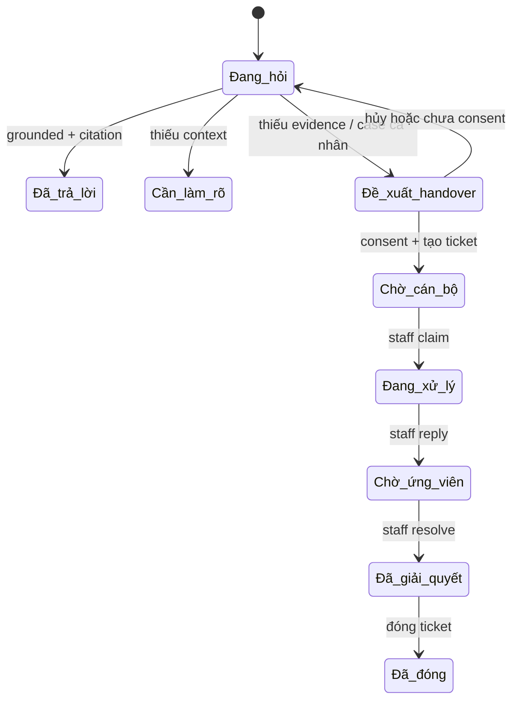
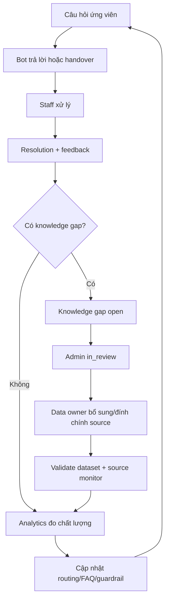

# VinUni Admissions Assistant — liên kết 3 luồng và kế hoạch vận hành

> Tài liệu trình bày với mentor: giải thích vì sao đây là một chatbot vận hành được, không chỉ là màn hình hỏi–đáp. Ba luồng **Ứng viên**, **Cán bộ** và **Admin** dùng chung một chuỗi dữ liệu, trạng thái và vòng phản hồi chất lượng.

## 1. Tóm tắt sản phẩm

VinUni Admissions Assistant là trợ lý tuyển sinh theo nguyên tắc **accuracy-first**:

1. Chatbot chỉ trả lời thông tin factual khi có evidence từ knowledge base đã xác minh.
2. Khi câu hỏi thiếu bằng chứng, liên quan hồ sơ cá nhân, nguồn đang thay đổi hoặc người dùng cần xử lý riêng, chatbot không đoán mà đề xuất chuyển cán bộ.
3. Một lần handover tạo ticket có transcript, evidence, confidence, lý do chuyển và dữ liệu liên hệ theo consent.
4. Ticket đi qua phân loại → routing → staff xử lý → phản hồi ứng viên → resolve.
5. Kết quả staff và knowledge gap quay lại Admin để cải thiện routing, tài liệu và câu trả lời của chatbot.

**Giá trị chính:** người học có câu trả lời nhanh và biết ticket đang ở đâu; cán bộ nhận đủ ngữ cảnh để không hỏi lại từ đầu; Admin nhìn thấy cả chất lượng bot lẫn năng lực xử lý của con người.

## 2. Bản đồ kiến trúc liên kết



### Nguyên tắc kết nối

| Khóa liên kết | Sinh ở đâu | Dùng để làm gì | Quyền truy cập |
|---|---|---|---|
| `session_id` | Chat lần đầu | Giữ context nhiều lượt; bảo vệ ticket ẩn danh trong browser | Người đang giữ session |
| `request_id` | Mỗi câu trả lời bot | Gắn feedback, latency, status và trace chất lượng | Backend/analytics |
| `ticket_id` | Khi consent handover | Theo dõi một yêu cầu xuyên suốt 3 luồng | Ứng viên đúng session/account; staff/admin theo role |
| `owner_user_id` | Backend khi có auth | Liên kết ticket với user account, dùng được trên thiết bị khác | Chỉ user sở hữu và staff/admin |
| `assigned_to` | Auto-routing hoặc Admin | Xác định cán bộ chịu trách nhiệm chính | Staff được phân công, admin |
| `gap_id` | Staff resolve với knowledge gap | Đưa vấn đề còn thiếu dữ liệu vào hàng review | Staff/admin |

`contact`/`user_email` chỉ phục vụ liên hệ và không được dùng làm khóa sở hữu. Sở hữu tài khoản dựa trên `owner_user_id`; người dùng ẩn danh vẫn được bảo vệ bởi `session_id`.

## 3. Luồng 1 — Ứng viên / người hỏi

### 3.1. Trải nghiệm chính

1. Mở `/chat`, nhập câu hỏi hoặc chọn gợi ý follow-up.
2. Frontend gửi `message` và giữ `session_id` trong local storage; transcript hiển thị trạng thái đang xử lý bằng vùng live status riêng.
3. Backend chạy classify → retrieve → generate/fallback → validate.
4. Nếu an toàn, UI hiển thị câu trả lời, citation, confidence, warning và nút đánh giá hữu ích.
5. Nếu cần cán bộ, UI mở handover dialog: tóm tắt, contact tùy chọn và checkbox consent bắt buộc.
6. Sau consent, ticket xuất hiện ở “Yêu cầu cán bộ”. Ứng viên ẩn danh theo dõi bằng session; ứng viên đã đăng nhập thấy toàn bộ ticket của mình qua account inbox.
7. Khi staff reply, tracker polling cập nhật trạng thái và nội dung trả lời; nếu có email hợp lệ backend gửi notification.

### 3.2. Kết nối API

| Bước | API | Dữ liệu quan trọng |
|---|---|---|
| Hỏi đáp | `POST /api/v1/chat` | `session_id`, `request_id`, `status`, `citations`, `grounded`, `handover_recommended` |
| Đánh giá | `POST /api/v1/feedback` | `request_id` + đúng `session_id`, rating và reason |
| Handover | `POST /api/v1/handover` | consent, câu hỏi, reason, transcript snapshot, evidence snapshot, contact |
| Ticket theo session | `GET /api/v1/handover/{ticket_id}` + `X-Session-ID` | Chỉ trả public ticket view, không lộ note/evidence nội bộ |
| Nhận ticket sau login | `POST /api/v1/handover/claim-session` | Gắn ticket anonymous cùng session vào `owner_user_id` |
| Inbox account | `GET /api/v1/handover/mine` | Ticket của user hiện tại, không lọc bằng email |

### 3.3. Các trạng thái có ý nghĩa với người dùng



### 3.4. Tối ưu thao tác

- Follow-up suggestion chỉ hiển thị dưới câu trả lời assistant mới nhất, tránh làm dài lịch sử.
- Nút retry giữ nguyên câu hỏi và session, không tạo context mới.
- Clear conversation chỉ xóa context chat; ticket đã tạo vẫn còn trong tracker/account inbox.
- Handover prefill email từ tài khoản nhưng vẫn cho phép sửa hoặc để trống.
- Polling ticket 5 giây khi trang còn mở; lỗi tracker được hiển thị riêng để người dùng biết cần retry.

## 4. Luồng 2 — Cán bộ / Staff

### 4.1. Hành trình xử lý

1. Đăng nhập `/staff` bằng staff token.
2. Xem metrics: ticket của mình, hàng chờ nhóm, quá SLA, resolved today và breakdown theo status/category/priority.
3. Queue chỉ gồm ticket đã giao cho cán bộ đó và ticket `new` chưa có owner nhưng đúng specialty của cán bộ. Staff không nhìn thấy ticket của nhóm khác.
4. Mở ticket: thấy câu hỏi, transcript, AI summary, suggested reply, confidence, evidence và activity timeline.
5. Ticket `new` có thể được cán bộ đang `available` nhận; thao tác này gắn `assigned_to`, gắn department và chuyển thẳng sang `in_progress`.
6. Ticket `assigned` do Auto-dispatch/Admin giao phải được cán bộ bấm “Bắt đầu xử lý” trước khi chuyển `in_progress`.
7. Gửi reply. Backend ghi `first_response_at`, `last_response_at`, chuyển `waiting_for_user`; email chỉ gửi nếu contact hợp lệ.
8. Staff có thể tiếp tục xử lý ticket đang chờ ứng viên, sau đó resolve với summary, resolution type và tùy chọn “knowledge gap”.
9. Khi đánh dấu knowledge gap, mô tả được đưa vào bảng review cho Admin; staff vẫn nhìn thấy hàng gap trong workspace.

### 4.3. Hợp đồng trạng thái giữa Staff và Admin

| Trạng thái | Ai tạo/chuyển | Ý nghĩa vận hành | Ai được thao tác tiếp |
|---|---|---|---|
| `new` | Hệ thống khi chưa có cán bộ phù hợp hoặc Admin gỡ phân công | Hàng chờ nhóm, chưa có owner | Admin assign hoặc staff đúng specialty claim |
| `assigned` | Auto-dispatch hoặc Admin | Đã có owner nhưng chưa acknowledge | Staff owner bắt đầu; Admin reassign |
| `in_progress` | Staff claim/bắt đầu/tiếp tục | Đang xử lý, SLA đang chạy | Staff owner reply hoặc chuyển chờ ứng viên |
| `waiting_for_user` | Staff reply | Đã gửi phản hồi, chờ ứng viên bổ sung/xác nhận | Staff owner tiếp tục hoặc resolve |
| `resolved` | Staff resolve sau khi có reply | Đã có kết quả xử lý và summary | Staff owner đóng; Admin chỉ giám sát |
| `closed` | Staff owner close | Kết thúc vòng đời, chỉ đọc | Không điều phối lại |

Admin là nơi quyết định ownership; Staff là nơi thực hiện nghiệp vụ. Vì vậy Admin không tự trả lời ứng viên, còn Staff không được tự chuyển ownership sang người khác.

### 4.2. API chính

- `GET /api/v1/staff/me`, `POST /api/v1/staff/me/availability`: hồ sơ và trạng thái nhận ticket.
- `GET /api/v1/staff/tickets`: queue có filter và sort.
- `POST /api/v1/staff/tickets/{ticket_id}/claim`: nhận ownership xử lý.
- `POST /api/v1/staff/tickets/{ticket_id}/notes`: ghi chú nội bộ, không xuất hiện ở public endpoint.
- `POST /api/v1/staff/tickets/{ticket_id}/reply`: gửi phản hồi và email nếu được phép.
- `POST /api/v1/staff/tickets/{ticket_id}/resolve`: hoàn tất, tạo knowledge gap nếu cần.
- `GET /api/v1/staff/knowledge-gaps`: xem gap do staff tạo.
- `GET /api/v1/staff/analytics`: theo dõi SLA và chất lượng vận hành.

### 4.3. Vì sao staff không cần hỏi lại từ đầu

Ticket lưu snapshot có kiểm soát của transcript và evidence tại thời điểm handover. Vì vậy staff nhận được “vấn đề + lý do chuyển + những gì bot đã kiểm tra”, trong khi dữ liệu nội bộ như note, evidence chi tiết và hoạt động hệ thống chỉ được trả ở staff/admin response.

## 5. Luồng 3 — Admin / vận hành

### 5.1. Các việc Admin làm được

1. Quản lý staff: thêm/cập nhật display name, department, specialty, availability, active.
2. Quản lý routing rule theo category và bật/tắt auto-assign.
3. Xem toàn bộ ticket, sắp xếp theo priority/trạng thái và assign/reassign thủ công cho cán bộ active không offline. Gỡ phân công sẽ đưa ticket về `new` nhưng vẫn giữ department routing để hàng chờ nhóm nhận đúng người.
4. Xem Quality loop 30 ngày: tổng interactions, answer rate, handover rate, helpful rate, latency.
5. Xem knowledge gaps đang mở; chuyển trạng thái `open` → `in_review` → `resolved`.
6. Dùng kết quả gap/analytics để quyết định bổ sung canonical source, sửa routing hoặc điều chỉnh FAQ.

### 5.2. API chính

- `GET/POST /api/v1/admin/staff`
- `GET/POST /api/v1/admin/routing-rules` và `/admin/routing-rules/{category}`
- `GET /api/v1/admin/tickets`, `POST /api/v1/admin/tickets/{ticket_id}/assign`
- `GET /api/v1/admin/analytics?days=30`
- `GET /api/v1/admin/knowledge-gaps?status=open`
- `POST /api/v1/admin/knowledge-gaps/{gap_id}` với `{ "status": "in_review" | "resolved" }`

Admin dùng token riêng, không dùng staff token. Frontend poll admin mỗi 8 giây, tạm dừng khi tab hidden và refresh ngay khi tab visible. Sau mỗi lần Admin assign/reassign, Staff nhận queue mới ở lần poll tiếp theo; sau mỗi lần Staff claim/status/reply, Admin thấy ownership và trạng thái mới trong lần refresh kế tiếp.

### 5.3. Vòng cải tiến khép kín



## 6. Data contract và bảo mật

### 6.1. Sở hữu dữ liệu

- `session_id` là khóa truy cập tạm thời cho người dùng chưa đăng nhập; endpoint ticket trả 404 giống nhau cho missing/unauthorized để giảm ID probing.
- Khi auth thành công, `claim-session` chỉ claim ticket còn `owner_user_id` rỗng. Không thể claim lại ticket đã thuộc user khác.
- `GET /handover/mine` chỉ dùng user id lấy từ bearer session trên backend.
- `clear session` xóa memory context nhưng không xóa ticket đã consent; người dùng không mất lịch sử hỗ trợ.
- Ticket public không trả internal notes/evidence/activity; staff/admin response mới có các trường vận hành.

### 6.2. Accuracy-first

- `answered` phải grounded và có citation.
- Source thiếu, stale, dynamic hoặc bị block sẽ chuyển sang clarification/handover thay vì đoán.
- Số liệu và hồ sơ cá nhân không được tự suy đoán; confidence là tín hiệu retrieval, không phải xác suất đúng.
- Mọi status message quan trọng (đang tải, lỗi, ticket cập nhật) có vùng thông báo riêng, không gắn `aria-live` lên toàn bộ message list.

## 7. Kịch bản demo mentor (5–7 phút)

### Phút 0–1: chứng minh bot có guardrail

1. Hỏi một câu có nguồn rõ, ví dụ học phí/ngành học.
2. Chỉ ra citation, trạng thái grounded và follow-up suggestion.
3. Hỏi một case hồ sơ cá nhân hoặc câu không đủ evidence.
4. Chỉ ra bot không hứa kết quả, mà đề xuất handover.

### Phút 1–3: nối Applicant → Staff

1. Mở handover dialog, kiểm tra transcript/evidence, tick consent và gửi.
2. Vào `/admin`, xác nhận ticket đang `new` hoặc đã được Auto-dispatch; nếu cần, assign cho cán bộ đúng nhóm.
3. Vào `/staff`, chứng minh ticket xuất hiện trong “Của tôi” hoặc “Hàng chờ nhóm”, rồi claim/bắt đầu xử lý.
4. Reply rồi resolve; quay lại `/admin` và `/chat` để thấy ownership, status và reply cập nhật.

### Phút 3–4: chứng minh account continuity

1. Tạo ticket anonymous trước login (hoặc dùng session hiện tại).
2. Đăng nhập/đăng ký OTP.
3. Gọi `claim-session`; mở lại trên tab/browser khác và chứng minh `/handover/mine` trả ticket theo account.
4. Nhấn mạnh email chỉ là contact; quyền sở hữu là `owner_user_id`.

### Phút 4–6: nối Staff → Admin

1. Resolve một ticket với knowledge gap.
2. Vào `/admin`, xem gap đang mở và chuyển sang `in_review`.
3. Xem quality cards: answer rate, handover rate, helpful rate, latency.
4. Đổi routing rule hoặc availability để minh họa ticket tiếp theo được route khác.

### Phút 6–7: chốt giá trị

> Bot xử lý nhanh phần có bằng chứng; người thật xử lý phần cần phán đoán; Admin dùng dữ liệu từ cả hai để làm hệ thống tốt hơn. Không có luồng nào bị cô lập.

## 8. Tiêu chí “đã đủ thực tế”

### Đã có trong bản hiện tại

- Chat nhiều lượt, context/session, citations, feedback, guardrail và handover có consent.
- Ticket lifecycle: new → assigned → in progress → waiting for user → resolved/closed.
- Auto-routing theo category/specialty/availability; team queue có scope theo specialty; Admin có thể reassign và unassign về đúng hàng chờ.
- Transition guard chống nhảy trạng thái và chống staff thao tác ticket không thuộc owner.
- AI summary, suggested reply, transcript/evidence snapshot và activity log.
- Account inbox xuyên thiết bị qua `owner_user_id`; anonymous claim sau login.
- Staff reply email có trạng thái delivery; public view không lộ dữ liệu nội bộ.
- Admin analytics và knowledge-gap review.
- Responsive UI, polling có pause khi tab ẩn, retry/error state và keyboard-friendly controls.

### Kiểm chứng tự động

```text
Backend: 107 passed
Frontend: npm run typecheck ✓
Frontend: npm run lint ✓
Frontend: npm run build ✓
```

Coverage mới bao gồm: ticket authenticated vào account inbox, anonymous ticket claim sau login, admin knowledge-gap status transition và admin analytics.

## 9. Lộ trình sau MVP

Các việc này có giá trị khi triển khai production lớn hơn, nhưng không chặn demo hiện tại:

1. Thay polling bằng SSE/WebSocket cho staff reply và ticket state realtime.
2. RBAC/SSO đầy đủ (admin, staff, data owner) và audit log bất biến.
3. Retention policy, mã hóa field liên hệ và job xóa dữ liệu theo consent/expiry.
4. Workflow data owner: preview diff → approve source → rebuild index → regression eval.
5. SLA notification đa kênh (email/in-app), escalation tự động khi quá hạn.
6. Dashboard cohort theo category/intent để ưu tiên tài liệu có tác động lớn nhất.

## 10. Tài liệu tham khảo thiết kế

- [Intercom — Conversation design for AI agents](https://www.intercom.com/blog/conversation-design-for-your-ai-agent/): follow-up có chủ đích, handoff phải giữ đủ context và agent cần biết khi nào dừng.
- [Microsoft — Bot navigation](https://learn.microsoft.com/en-us/azure/bot-service/bot-service-design-navigation?view=azure-bot-service-4.0): giữ người dùng trong topic hiện tại và cung cấp đường quay lại rõ ràng.
- [Microsoft — Writing for bots](https://github.com/MicrosoftDocs/microsoft-style-guide/blob/main/styleguide/chatbots-virtual-agents/writing-bots.md): nêu giới hạn, tín hiệu escalation và hướng dẫn hành động tiếp theo.
- [WCAG 2.2 — Status Messages](https://www.w3.org/TR/WCAG22/#status-messages): trạng thái loading/success/error cần được công bố cho công nghệ hỗ trợ mà không buộc người dùng mất focus.
