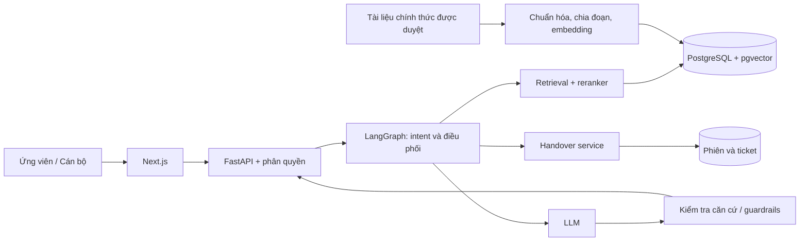

# PRD — Trợ lý tuyển sinh X

**EDU-12 · Nhóm 1009 · Mã đội T051 · Gate G1 · Phiên bản 1.0 · 20/09/2026**

Trạng thái: đề xuất thiết kế để chốt phạm vi. Chưa triển khai, chưa có số liệu đánh giá. Trường X là tên giữ chỗ theo đề bài; chưa xác định trường hoặc nguồn tuyển sinh thực tế. Các con số về chất lượng bên dưới là mục tiêu, không phải kết quả.

## 1. Vấn đề, mục tiêu và người dùng

Ứng viên cần câu trả lời nhanh, có căn cứ và hướng dẫn bước tiếp theo. Cán bộ cần giảm câu hỏi lặp và tập trung vào ngoại lệ. Sản phẩm cung cấp hỏi đáp 24/7 về ngành, điều kiện, học phí, học bổng và quy trình; handover bảo đảm các câu hỏi thiếu căn cứ hoặc nhạy cảm được người có thẩm quyền xử lý.

| Vai trò | Nhu cầu | Quyền |
|---|---|---|
| Ứng viên | Hỏi, xem nguồn, biết bước tiếp theo, yêu cầu cán bộ | Dùng phiên ẩn danh; chỉ xem hội thoại và yêu cầu của mình |
| Cán bộ tuyển sinh | Nhận và giải quyết ngoại lệ | Đăng nhập; truy cập hàng chờ được phân quyền; phản hồi và cập nhật trạng thái |

Không mặc định yêu cầu ứng viên tạo tài khoản hoặc cung cấp thông tin định danh. Việc tạo tài khoản cán bộ và cập nhật kho nguồn do người vận hành được ủy quyền thực hiện, chưa cần một giao diện quản trị thứ ba trong MVP.

## 2. Phạm vi và mức ưu tiên

**P0 — MVP:** chat có nguồn; hướng dẫn hồ sơ theo tài liệu; hội thoại trong phiên; phát hiện câu vượt phạm vi/nhạy cảm; handover; hàng chờ và phản hồi cán bộ; bộ test có nhãn và báo cáo KPI. Web app hai vai trò được deploy ở giai đoạn xây dựng sau G1.

**P1 — nâng cao:** cá nhân hóa qua hồ sơ tự nguyện; gợi ý bước tiếp theo và nurture có đồng ý; dashboard engagement; caching câu hỏi chung với cơ chế vô hiệu hóa khi nguồn đổi. Guardrail chống bịa là P0, không chờ đến nâng cao.

**Ngoài phạm vi:** quyết định tuyển sinh, dự đoán chắc chắn trúng tuyển, nhận hồ sơ/thanh toán chính thức, kết nối tất cả kênh truyền thông, tự động gửi tiếp thị ngoài phiên khi chưa được đồng ý.

## 3. Yêu cầu chức năng và nghiệm thu

| ID | User story / Yêu cầu | Tiêu chí nghiệm thu dự kiến |
|---|---|---|
| FR-01 | Ứng viên hỏi về tuyển sinh | Đầu vào trống không gọi AI; câu hỏi hợp lệ hiển thị trạng thái xử lý và câu trả lời hoặc fallback; lỗi có nút thử lại |
| FR-02 | Ứng viên kiểm tra căn cứ | Mỗi câu trả lời chứa thông tin tuyển sinh phải có nguồn hỗ trợ tương ứng: tên tài liệu, URL, mục/trang nếu có, kỳ áp dụng; bấm được link nguồn |
| FR-03 | Trợ lý làm rõ nhu cầu | Khi thiếu ngành/bậc/kỳ cần cho câu trả lời, hỏi làm rõ; không tự suy đoán; người dùng có thể bỏ chọn hoặc đổi thông tin trong phiên |
| FR-04 | Ứng viên xem hướng dẫn nộp hồ sơ | Checklist và link nộp lấy từ nguồn đã duyệt; không có nguồn thì không sinh hạn, giấy tờ hoặc điều kiện giả |
| FR-05 | Trợ lý phát hiện ngoại lệ | Thiếu nguồn, nguồn mâu thuẫn/hết hiệu lực, câu nhạy cảm hoặc yêu cầu cam kết dẫn đến thông báo giới hạn và đề nghị cán bộ; không trả lời quyết định trúng tuyển |
| FR-06 | Ứng viên đồng ý handover | Xem trước nội dung chuyển, đồng ý rồi mới tạo yêu cầu; có mã và trạng thái; hủy không tạo ticket; thông tin liên hệ là tùy chọn nếu muốn được liên lạc ngoài phiên |
| FR-07 | Cán bộ xử lý yêu cầu | Chỉ cán bộ đăng nhập và có quyền xem hàng chờ; nhận xử lý, phản hồi, đóng; ứng viên cùng phiên xem được phản hồi; người khác không truy cập được ticket bằng cách đoán ID |
| FR-08 | Duy trì hội thoại | Câu hỏi tiếp nối dùng ngành/kỳ đã chọn trong phiên; xóa phiên xóa ngữ cảnh theo chính sách, không trộn dữ liệu giữa ứng viên |
| FR-09 | Kiểm soát nguồn | Tài liệu trước khi lập chỉ mục phải có người xác minh, URL chính thức, kỳ áp dụng, phiên bản; nguồn bị thu hồi không được dùng để sinh câu trả lời mới |
| FR-10 | Đo chất lượng | Báo cáo tái lập được từ phiên bản bộ test, nguồn, model và prompt; ghi riêng answer rate, accuracy, lỗi bịa nghiêm trọng, handover, độ trễ và chi phí |
| FR-11 (P1) | Cá nhân hóa/nurture | Chỉ lưu hồ sơ và gửi nhắc khi người dùng chủ động đồng ý; có cách rút lại; không dùng đặc điểm nhạy cảm để suy diễn cơ hội tuyển sinh |
| FR-12 (P1) | Dashboard/caching | Engagement dùng dữ liệu tối thiểu; cache chỉ câu chung, gắn phiên bản nguồn và kỳ tuyển sinh, không dùng chung câu trả lời có thông tin cá nhân |

## 4. Luồng nghiệp vụ

1. Ứng viên mở chat, đọc giới hạn và nhập câu hỏi; có thể chọn ngành/kỳ quan tâm.
2. Hệ thống kiểm tra đầu vào và ý định, yêu cầu làm rõ nếu thiếu thông tin thiết yếu.
3. Truy xuất tài liệu theo kỳ/nguồn đã duyệt, rerank, đánh giá mức đủ căn cứ. Ngưỡng truy xuất được hiệu chỉnh bằng tập development; không coi điểm tự tin của LLM là bảo đảm chính xác.
4. Nếu đủ căn cứ, sinh câu trả lời có nguồn, kiểm tra các khẳng định và gợi ý bước tiếp theo. Nếu không, fallback hoặc đề nghị handover.
5. Khi ứng viên đồng ý, tạo ticket có tóm tắt đã xem trước và ngữ cảnh tối thiểu; không hứa thời gian phản hồi khi chưa có SLA từ trường.
6. Cán bộ nhận xử lý → phản hồi → đóng. Ứng viên xem trạng thái/phản hồi trong phiên; nếu mất phiên và không cung cấp kênh liên hệ thì chưa hỗ trợ khôi phục ở MVP.

Trạng thái ticket: `waiting → in_progress → resolved`. Lỗi tạo ticket phải báo rõ chưa gửi và cho thử lại; retry sử dụng khóa idempotency để tránh trùng.

## 5. Dữ liệu, bảo mật và guardrails

- Nguồn: website, quy chế, đề án, thông báo tuyển sinh chính thức được trường xác nhận. Chưa có URL cụ thể; không sử dụng tài liệu minh họa như nguồn thật.
- Metadata: `document_id`, tên, URL, mục/trang, kỳ tuyển sinh, phiên bản, ngày xác minh, người xác minh, hiệu lực. Nguồn mâu thuẫn cần cán bộ quyết định, AI không tự chọn một mức học phí hay hạn nộp.
- Dữ liệu phiên: ID ngẫu nhiên, ngành/bậc/kỳ tự chọn, hội thoại cần thiết. Không bắt buộc tên thật, CCCD, địa chỉ, số điện thoại hoặc hồ sơ học tập.
- Handover: ticket ID, phiên sở hữu, tóm tắt, nội dung được đồng ý chuyển, trạng thái, người xử lý, phản hồi và mốc thời gian. Liên hệ tùy chọn phải tách khỏi log phân tích.
- Chính sách lưu trữ đề xuất, cần trường duyệt trước pilot: phiên ẩn danh hết hạn sau 24 giờ không hoạt động; ticket xóa/ẩn danh trong 30 ngày sau khi đóng; chỉ giữ thống kê tổng hợp không định danh lâu hơn. Không đưa dữ liệu liên hệ vào cache hay telemetry AI.
- HTTPS khi deploy; khóa API ở môi trường server; kiểm tra quyền trên từng ticket; che dữ liệu cá nhân trong log; giới hạn tần suất và kích thước đầu vào.
- Xem tài liệu truy xuất và prompt người dùng là dữ liệu không đáng tin; không làm theo chỉ dẫn thay đổi chính sách/tiết lộ bí mật nằm trong tài liệu. Không dùng công cụ có quyền quyết định tuyển sinh.
- Không bảo đảm trúng tuyển/học bổng; không suy diễn theo giới tính, dân tộc, điều kiện kinh tế. Thông tin điều kiện chính thức phải được dẫn đúng nguồn, áp dụng nhất quán.

## 6. Kiến trúc dự kiến

Đây là thiết kế đề xuất, không mô tả tính năng đã có trong code. API dự kiến: `POST /chat`, `POST /handover`, `GET /tickets/{id}`, `GET /staff/tickets`, `POST /staff/tickets/{id}/claim`, `POST /staff/tickets/{id}/reply`, `POST /staff/tickets/{id}/resolve`. Các route staff bắt buộc xác thực; route ứng viên kiểm tra quyền phiên.

Docker và cloud dùng khi triển khai. Model, embedding và reranker được chọn sau benchmark tiếng Việt về chất lượng/chi phí. Mục tiêu kỹ thuật đề xuất: p95 phản hồi hoàn chỉnh ≤10 giây tại 20 phiên đồng thời, giới hạn 2.000 ký tự mỗi câu hỏi; cần đo thực tế và điều chỉnh cùng ngân sách. Có timeout, thông báo lỗi và handover thay vì chờ vô hạn. Theo dõi token và chi phí mỗi lượt; chốt trần ngân sách trước pilot.

## 7. Kế hoạch đánh giá và KPI

Đề xuất tối thiểu 100 câu có nhãn, bao phủ ngành/điều kiện, hồ sơ/hạn, học phí, học bổng, hội thoại tiếp nối và trường hợp phải từ chối/handover. Cán bộ xác nhận đáp án, nguồn, kỳ và hành vi kỳ vọng. Có tập development riêng để chỉnh hệ thống; đóng băng test trước đánh giá, không chỉnh ngưỡng trên test.

| Chỉ số | Định nghĩa | Mục tiêu |
|---|---|---|
| Answer rate | Số câu trong nhóm hỏi đáp tuyển sinh hợp lệ được AI trả lời thực chất, không chuyển cán bộ / tổng câu của nhóm này. Câu hỏi làm rõ đơn thuần chưa tính trả lời | ≥70% |
| Accuracy | Số câu trả lời AI được chấm đúng, đủ, có nguồn hỗ trợ / tổng câu AI đã trả lời trong nhóm trên. Nếu không có câu trả lời, báo N/A và không đạt | ≥85% |
| Giảm tải cán bộ | `(B − P) / B × 100%`; B và P là số câu hỏi trực tiếp cho cán bộ trên mỗi 100 ứng viên ở giai đoạn baseline/pilot tương đương | ≥50%; B phải >0 |
| Guardrail | Báo riêng tỷ lệ xử lý đúng tập nhạy cảm/vượt phạm vi và số lỗi bịa cam kết, học phí, điều kiện, hạn nộp | Không chấp nhận lỗi bịa nghiêm trọng trước pilot |

Công bố số mẫu và kết quả từng nhóm; không loại câu khó khỏi mẫu sau khi chạy. Trường hợp bắt buộc handover nằm trong tập an toàn riêng, không coi handover đúng là câu trả lời sai. Nếu báo thêm accuracy trên toàn bộ câu hỏi, phải đặt tên riêng và nêu mẫu số.

LLM-as-Judge hỗ trợ chấm theo rubric nhưng cán bộ/người đánh giá kiểm tra, nhất là lỗi nghiêm trọng và trường hợp bất đồng. Lưu phiên bản model, prompt, nguồn, bộ test, câu trả lời và nhãn đánh giá đã loại dữ liệu cá nhân.

KPI giảm tải cần pilot thực tế, bao gồm cả ticket chatbot chuyển đến cán bộ và câu hỏi qua kênh khác; chuẩn hóa theo lượng ứng viên, kiểm soát khác biệt mùa tuyển sinh. Khi chưa có baseline, ghi “chưa đủ dữ liệu”, không suy từ answer rate. Engagement nâng cao đo lượt hoàn thành checklist và click nguồn/link chính thức; không tự xem click là đã nộp hồ sơ.

## 8. Kế hoạch và trách nhiệm

| Thành viên | Mã học viên | Phân công đề xuất — chờ nhóm thống nhất |
|---|---|---|
| Nguyễn Quang Huy | 2A202602820 | Điều phối, Brief/PRD, backend tích hợp |
| Lê Văn Tài | 2A202602464 | Nguồn dữ liệu, RAG và bộ test |
| Cao Văn Cường | 2A202602493 | Wireframe, frontend và UX |
| Chu Phúc Anh | 2A202602370 | Handover, kiểm thử, DevOps và kiểm tra AI logging |

G1: chốt bài toán, phạm vi, tài liệu và thiết kế; deadline theo thông tin nhóm cung cấp: 23:59 ngày 20/09/2026. Sau G1: xác minh nguồn → làm luồng chat có nguồn → triển khai handover → đánh giá → pilot giảm tải. Chưa ấn định các deadline sau G1.

## 9. Điểm cần xác nhận trước triển khai

1. Trường X là trường nào, kỳ tuyển sinh nào, ai duyệt nguồn và làm đầu mối HITL?
2. Dữ liệu baseline có sẵn không, nhóm được phép pilot với ai và trong thời gian nào?
3. Ngân sách LLM/cloud, SLA cán bộ và chính sách lưu trữ được duyệt là gì?
4. Mã đội người dùng cung cấp là T051; tên repo hiện tại là P-051. Giữ nguyên cả hai và đối chiếu trên Phoenix trước nộp, không tự đổi repo.

## 10. Minh chứng G1

- [Brief](brief.md), bản in [brief.html](brief.html).
- [Wireframe tương tác](wireframe/index.html) và [UI flow](wireframe/ui-flow.md).
- Các tài liệu này không xác nhận GitHub Actions, deploy hay AI logging đã thành công; các phần đó cần bằng chứng chạy thực tế riêng.
