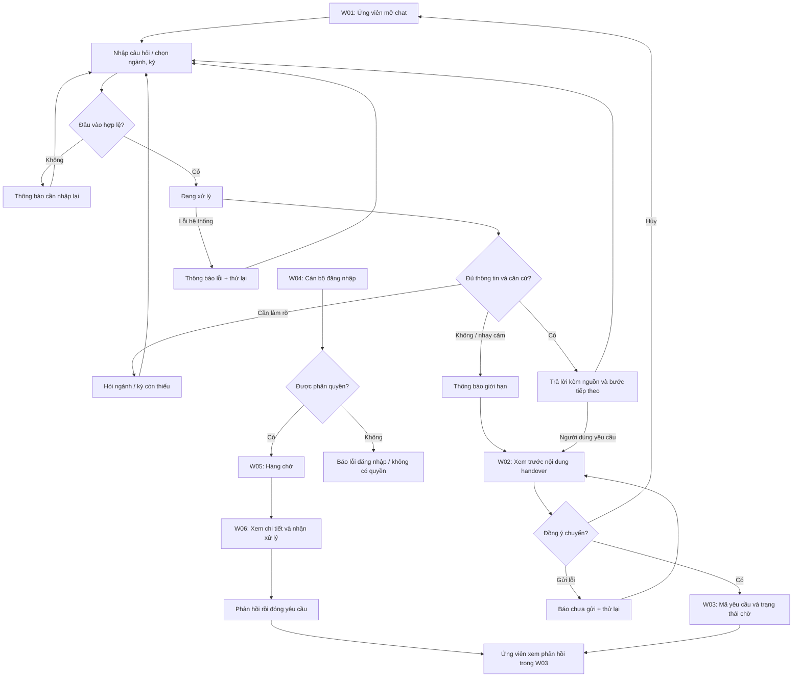

# UI Flow — EDU-12
Nhóm 1009 · T051 · Gate G1 · 20/09/2026

Đây là thiết kế đề xuất, chưa kết nối backend. Mở `index.html` bằng trình duyệt để xem các màn hình và thử thao tác minh họa. Nội dung nguồn, ticket và cán bộ đều là dữ liệu minh họa; không có thông tin tuyển sinh thật.

| Màn hình | Nội dung và hành động | Yêu cầu PRD |
|---|---|---|
| W01 Chat | Gợi ý chủ đề; ngữ cảnh tự chọn; câu hỏi; loading; nguồn; fallback; retry | FR-01–05, FR-08 |
| W02 Handover | Tóm tắt có thể sửa; liên hệ tùy chọn; đồng ý; gửi/hủy | FR-06 |
| W03 Theo dõi | Ticket và trạng thái chờ/đang xử lý/đã giải quyết; phản hồi | FR-06–07 |
| W04 Đăng nhập | Tài khoản cán bộ; lỗi xác thực; không có quyền | FR-07 |
| W05 Hàng chờ | Danh sách tối thiểu, trạng thái, hàng chờ trống | FR-07 |
| W06 Chi tiết | Tóm tắt đã đồng ý chia sẻ; nhận xử lý; phản hồi; đóng | FR-07 |

## Cách duyệt prototype
1. Ở Chat, chọn trạng thái minh họa rồi gửi một câu hỏi. Các trạng thái không gọi AI.
2. Chọn “Chuyển cán bộ”, xem/sửa tóm tắt, đánh dấu đồng ý rồi gửi để thấy mã yêu cầu.
3. Mở “Cán bộ”, vào hàng chờ demo, nhận xử lý, nhập phản hồi và đóng.
4. Mở “Theo dõi” để xem trạng thái/phản hồi được cập nhật trong bộ nhớ trang.

Prototype không xác thực thật, không lưu dữ liệu sau tải lại, không gửi mạng. Bản sản phẩm phải thực thi phân quyền server và chính sách lưu trữ trong PRD. Link nguồn chính thức và SLA cán bộ chỉ được bổ sung khi trường xác nhận.
